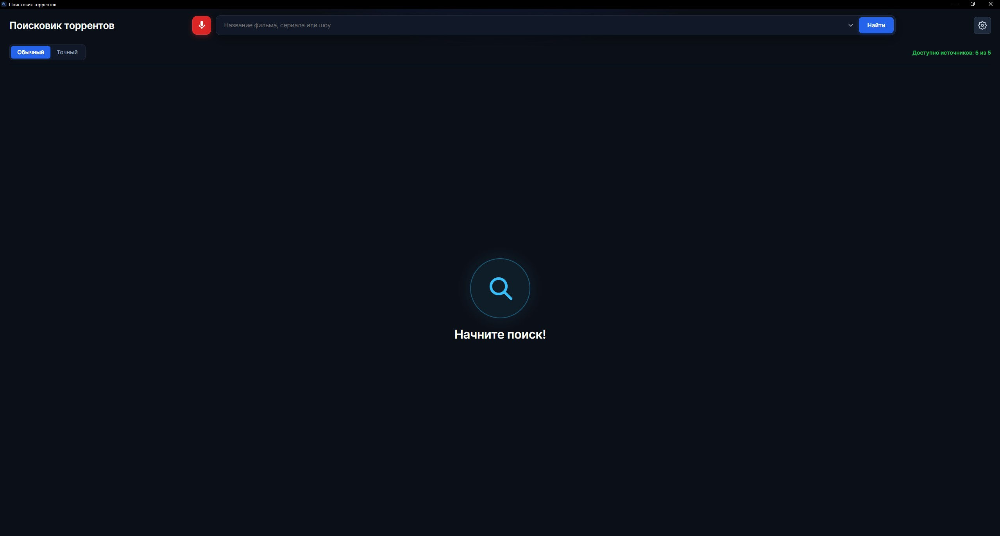
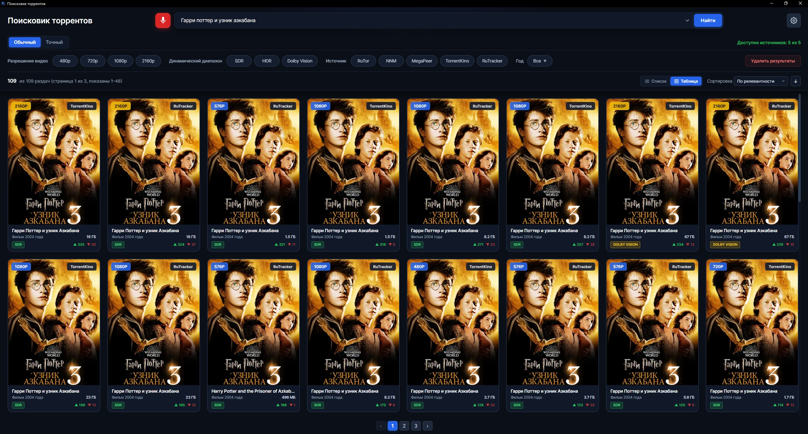
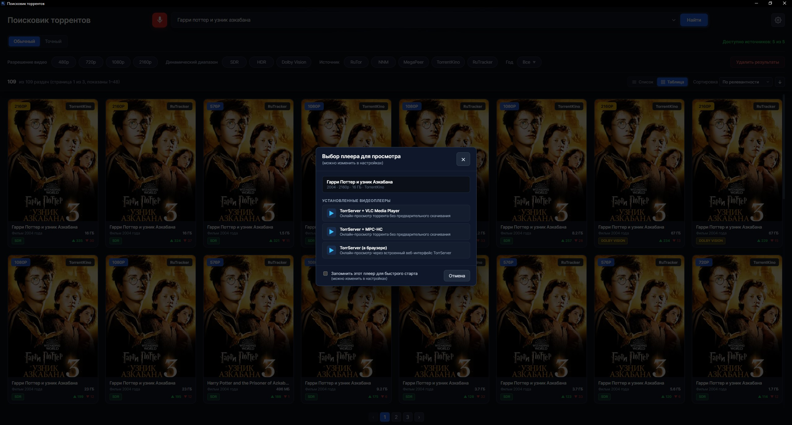
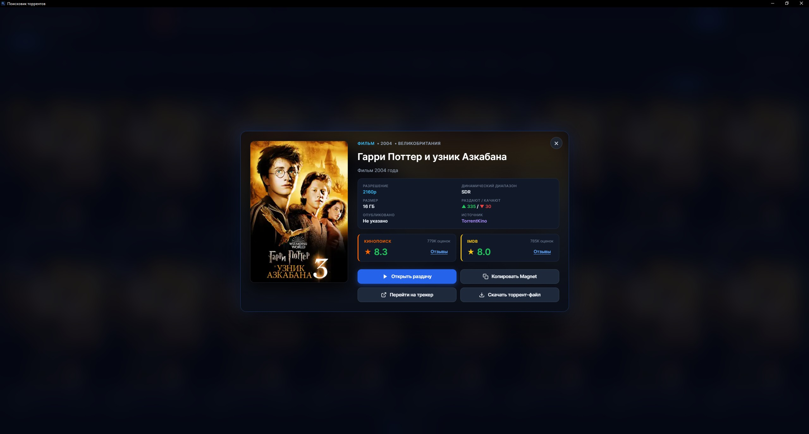
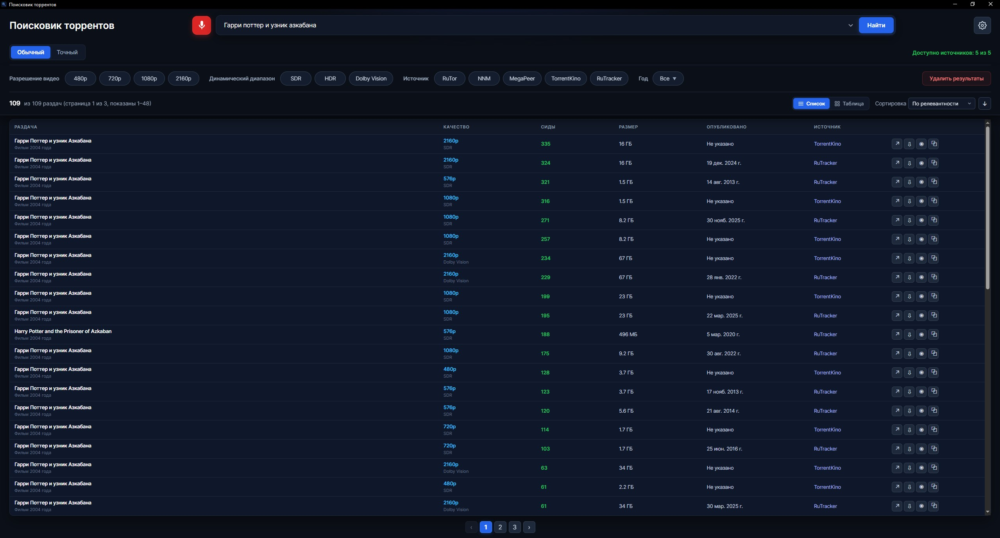
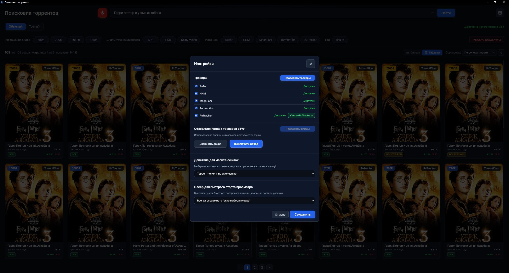
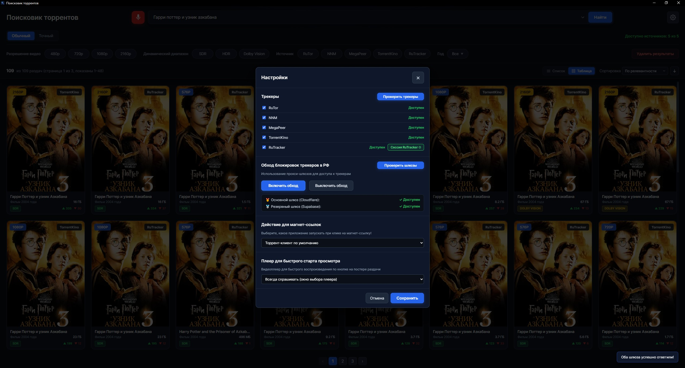

  

  # Поисковик торрентов

  
  [-0078D6.svg)](https://github.com/Yura1206/poisk_torrentov/releases)
  [-brightgreen.svg)](https://www.virustotal.com/gui/file/f300abb458703ba88bba174762a1d50637251f8abf7764a63940981982a00cc2)
  

**Поисковик торрентов** — современное, быстрое и удобное настольное приложение для Windows, объединяющее поиск фильмов, сериалов и телешоу по крупнейшим русскоязычным каталогам (RuTracker, RuTor, NNM-Club, MegaPeer, TorrentKino) в едином интерфейсе.

Больше не нужно вручную открывать десятки сайтов: приложение параллельно опрашивает базы, группирует результаты по фильмам с официальными постерами, подтягивает рейтинги **Кинопоиска** и **IMDb** с прямыми ссылками на отзывы зрителей, позволяет мгновенно фильтровать раздачи по разрешению и цветовому диапазону видео, по году выпуска, сезонам/частям и источникам, запускать онлайн-просмотр видео без ожидания скачивания и обеспечивает стабильный доступ через **встроенный обход блокировок для России**.

---

## 📥 Быстрое скачивание программы

Установка не требуется. Выберите подходящий вариант:

| Вариант | Описание | Ссылка на скачивание |
| :--- | :--- | :--- |
| ⚡ **Портативная версия (Portable .exe)** | Один исполняемый файл. Работает из любой папки или с USB-накопителя без установки. | 👉 [**Скачать Poiskovik_torrentov.exe**](https://github.com/Yura1206/poisk_torrentov/releases/latest/download/Poiskovik_torrentov.exe) |
| 📦 **Распакованная версия (Unpacked .zip)** | Архив с готовой папкой программы. Обеспечивает максимальную скорость старта приложения. | 👉 [**Скачать Poiskovik_torrentov_unpacked.zip**](https://github.com/Yura1206/poisk_torrentov/releases/latest/download/Poiskovik_torrentov_unpacked.zip) |

> 🔗 Все выпуски и история обновлений программы: **[Страница релизов на GitHub](https://github.com/Yura1206/poisk_torrentov/releases)**.

---

### 🛡️ Безопасность и проверка VirusTotal
Файлы проверены сервисом VirusTotal более чем 70 антивирусными базами — угроз и вредоносного кода не обнаружено (0 срабатываний):  
👉 **[Открыть полный отчёт проверки на VirusTotal](https://www.virustotal.com/gui/file/f300abb458703ba88bba174762a1d50637251f8abf7764a63940981982a00cc2)**

> 💡 **Первый запуск в Windows (SmartScreen):**  
> Поскольку программа является независимым бесплатным проектом без платной цифровой подписи корпорации Microsoft, фильтр **SmartScreen** при первом запуске может показать предупреждение.  
> **Чтобы запустить программу:**  
> 1. Нажмите ссылку **«Подробнее»** (*More info*).  
> 2. Нажмите кнопку **«Выполнить в любом случае»** (*Run anyway*).  
> *(Также можно нажать правой кнопкой мыши по файлу -> Свойства -> поставить галочку «Разблокировать»). Выбор подтверждается один раз, далее программа запускается сразу.*

---

## 📸 Скриншоты программы

> 🔍 *Все скриншоты кликабельны: нажмите на любую картинку, чтобы открыть её в оригинальном полном разрешении (2560×1440).*

### 1. Главный экран поиска
Лаконичный темный интерфейс, строка поиска с историей запросов и поддержкой голосового ввода.

---

### 2. Голосовой поиск
Встроенное распознавание русской речи в один клик: назовите фильм или сериал в микрофон без набора на клавиатуре.

---

### 3. Результаты поиска: режим постеров и умные фильтры
Умная группировка по фильмам с официальными постерами, бейджами качества (2160p 4K, 1080p, HDR, Dolby Vision), индикацией раздающих/качающих и мгновенной локальной фильтрацией.

---

### 4. Онлайн-просмотр видео без скачивания
Интеграция с локальным сервером **TorrServer**: воспроизведение фильма прямо из раздачи через внешний видеоплеер (VLC Media Player, MPC-HC) или прямо в окне браузера.

---

### 5. Карточка фильма с рейтингами и отзывами
Подробная внутренняя карточка раздачи с актуальными оценками **Кинопоиска** и **IMDb**, прямыми кликабельными ссылками на страницы с отзывами зрителей, быстрым запуском раздачи, копированием Magnet-ссылки, переходом на первоисточник и скачиванием `.torrent`-файла.

---

### 6. Результаты поиска: детальный режим списка
Классическая компактная таблица с подробными характеристиками каждой раздачи, сортировкой по релевантности, сидам, качеству, дате публикации и размеру.

---

### 7. Настройки источников и параметров
Быстрая проверка доступности всех пяти трекеров, выбор торрент-клиента по умолчанию (qBittorrent, uTorrent, Transmission и др.) и настройка предпочтительного видеоплеера.

---

### 8. Встроенный обход блокировок для России (прокси-шлюзы)
Отказоустойчивая система встроенных шлюзов (Cloudflare Worker и Supabase Edge) для стабильной работы трекеров в России без необходимости настройки сторонних VPN.

---

## ✨ Ключевые возможности

- 🌐 **Встроенный обход блокировок для России:**
  - Встроенные скоростные шлюзы (Cloudflare Worker и резервный шлюз Supabase Edge) обеспечивают надёжный доступ ко всем каталогам без установки сторонних VPN.
- 🖼️ **Режимы отображения результатов:**
  - **Режим «Таблица» (сетка постеров):** визуальное представление с постерами высокого разрешения, цветными бейджами качества и компактной технической информацией.
  - **Режим «Список»:** классический компактный табличный вид с подробными данными (размер, дата, сиды, личеры, источник).
- 🗂️ **Внутренняя карточка фильма и раздачи:**
  - Рейтинги **Кинопоиска** и **IMDb** с количеством оценок.
  - Прямые ссылки на **отзывы зрителей** на Кинопоиске и IMDb (открываются в браузере в один клик).
  - Удобные действия: открытие воспроизведения, копирование magnet-ссылки, скачивание `.torrent` и переход на страницу трекера.
- 🎙️ **Голосовой поиск на русском языке:**
  - Быстрый ввод названия фильма голосом через микрофон с автоматическим распознаванием.
- 🎬 **Онлайн-просмотр без скачивания (TorrServer):**
  - Поддержка стриминга торрентов на лету через **TorrServer** в связке с VLC, Media Player Classic (MPC-HC) или веб-плеером.
- 🚀 **Параллельный опрос 5 ведущих каталогов:**
  - **RuTracker** — поддержка авторизации (вход через встроенное безопасное окно с автосохранением сессии или ручной ввод Cookie).
  - **RuTor** — открытый каталог с актуальными пирами и magnet-ссылками.
  - **NNM-Club** — автоповтор при временных ошибках трекера и прямая загрузка торрентов.
  - **MegaPeer** — быстрый поиск с прямыми торрент-файлами и сидами.
  - **TorrentKino** — каталог фильмов и сериалов.
- ⚡ **Мгновенные локальные фильтры (без повторных запросов в сеть):**
  - Разрешение: **480p**, **720p**, **1080p**, **2160p (4K)**.
  - Динамический диапазон: **SDR**, **HDR**, **Dolby Vision**.
  - Фильтр по годам выпуска и источникам.
  - Сортировка по релевантности, сидам, размеру и дате публикации.
- 🎨 **Удобный интерфейс:**
  - Контрастная плоская иконка приложения.
  - Отзывчивый темный интерфейс.
  - Окно карточки остаётся открытым при запуске воспроизведения.
- 🔒 **Конфиденциальность и безопасность:**
  - Без рекламы, скрытых процессов и телеметрии.
  - Все сессии, история поиска и настройки сохраняются строго локально на вашем компьютере (`%APPDATA%`).

---

## 🖥️ Системные требования

- **Операционная система:** Windows 10 / Windows 11 (64-бит)
- **Интернет:** подключение к сети
- **Дополнительно (по желанию):** установленный торрент-клиент (qBittorrent, uTorrent) или TorrServer для онлайн-просмотра.

---

## ⚖️ Правовая информация и лицензия

- Программа распространяется под свободной лицензией **[MIT](LICENSE)**.
- Приложение является агрегатором и обращается исключительно к общедоступным веб-страницам открытых каталогов. Приложение не хранит, не распространяет и не хостит медиафайлы. Пользователь несёт личную ответственность за соблюдение правил каталогов и законодательства своей юрисдикции.
